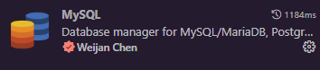
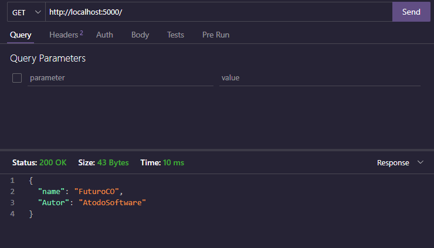

## How to run backend:

- [How to run backend:](#how-to-run-backend)
  - [Requirements](#requirements)
    - [MySQL Server](#mysql-server)
    - [API Client](#api-client)
  - [Install dependencies](#install-dependencies)
    - [Create .env file](#create-env-file)
  - [Run server](#run-server)

### Requirements

#### MySQL Server
Yo need to have installed MYSQL server to start work with the backend

After the installation you can use `MySQL Workbench` or you could install the `MySQL extension` in VSCode:



After the installation you can import the database located in `backend/database/database.sql` in your MySQL server in that way you can start inserting records from the app

#### API Client

Also you need to have installed an API client manager like `postman` or `Thunder Client for VSCode` to start send requests to API before to connect with frontend

### Install dependencies
Once you have installed MySQL you need to re-install the dependencies in the project to install the `backend dependencies needed`.

#### Create .env file

You need to create the `.env` file in the root directory of the project

In the `.env` file we need to put the following values:

```
API_KEY // Helps the app to connect with backend
API_ENDPOINT = /api/v1/data // Endpoint used to send requests to API 
API_URL = /api/v1 // USE to manage internal communication
NODE_ENV = development // Environment for database
DB_PORT = 5000 // Port selected to run the backend
DB_HOST = localhost
DB_DATABASE = // name of your database
DB_USERNAME = // username of your MYSQL 
DB_PASSWORD = 
```

### Run server

To run server you can write in your terminal `npm run upServer` and the backend starts run.

To confirm that the server is running you can send an request through you API client. Example: 

